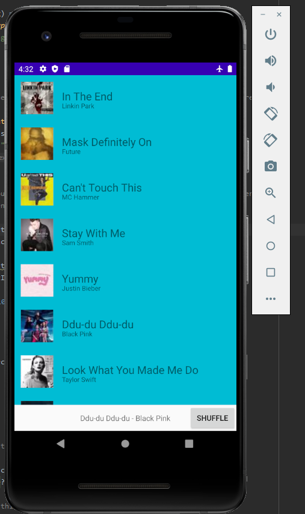
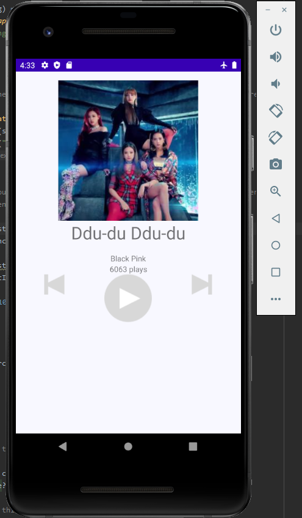

# Dotify
## Jay Houppermans

The third version of the homework project for my Android Development class

A music player app for my Android Development class, though it doesn't yet have the ability to play music.
It now has an implemented list of songs, as well as the ability to shuffle on that list and select a song.

I did not attempt any extra credit.

## Completion Status

I have completed all points in the spec, except for the following:
<ul>
<li>2aiii, the shuffleList method, does not work and is commented out</li>
<li>3ii1, clicking the shuffle button does nothing</li>
<li>4a, the mini player does not keep the same song info</li>
<li>4b, the play count does not remain consistent</li>
<li>6a, while the back functionality is enabled via the android back button, there is no
custom button fulfilling that functionality</li>
<li>7, there is no rotation implementation</li>
</ul>

Additional known bugs:
<ul>
<li>The "dotify" title bar is not displayed</li>
<li>The images of songs later on the recyclerview list do not render</li>
</ul>

## Regarding the major functionalities on the rubric:
I believe I have fulfilled, more or less, all of the requirements with the exception of the following.
However, the implementations are somewhat buggy, as stated above
<ul>
<li> Partial implementation - Up/Back button displays & pops back-stack </li>
<li> Current song & play count restores onDestroy() and onCreate()</li>
<li>Has landscape xml & shows all buttons & info clearly</li>
</ul>

